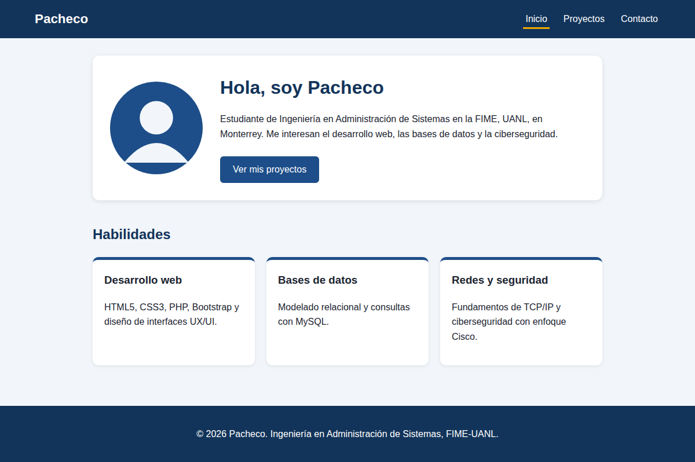
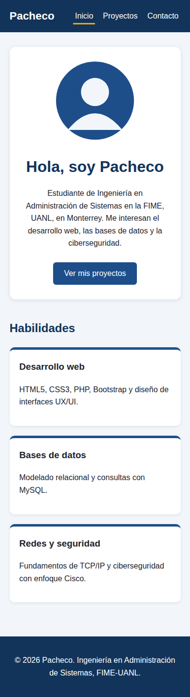
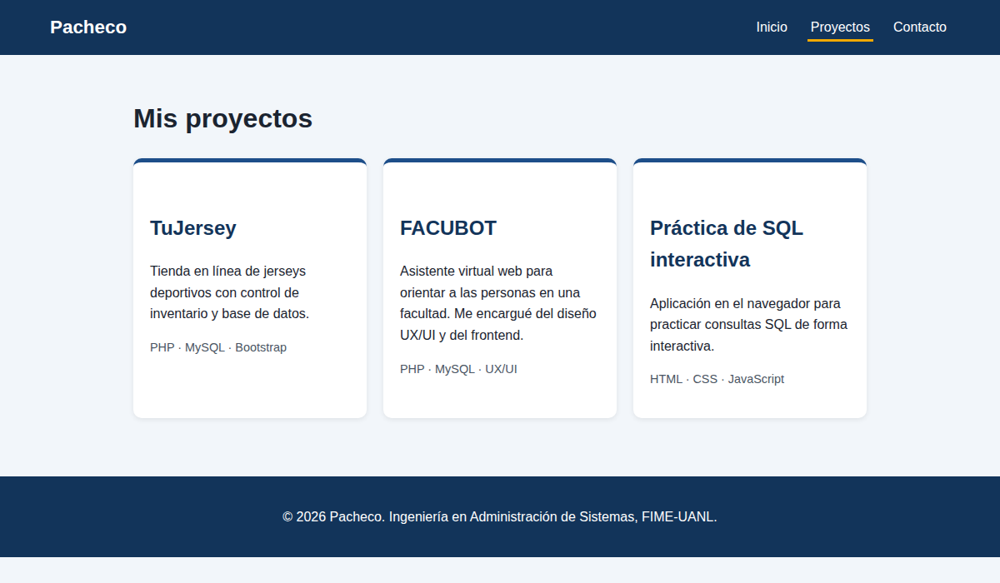
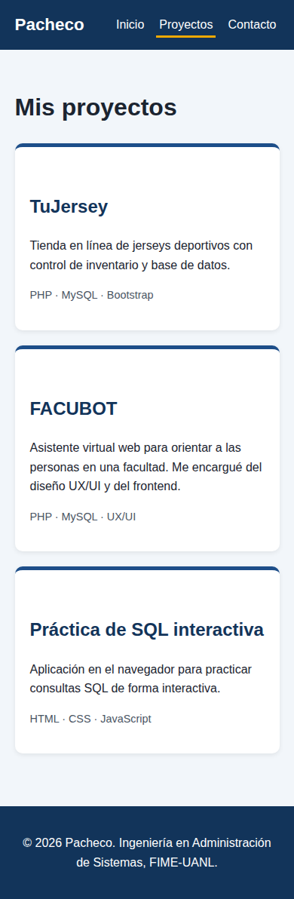
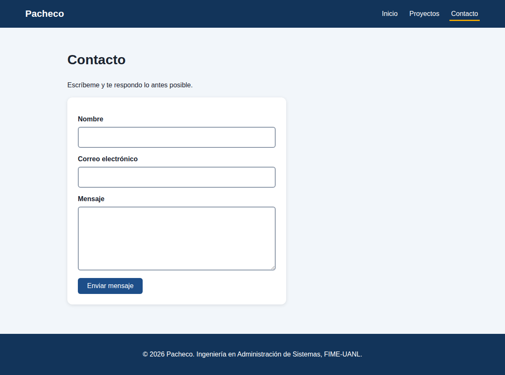
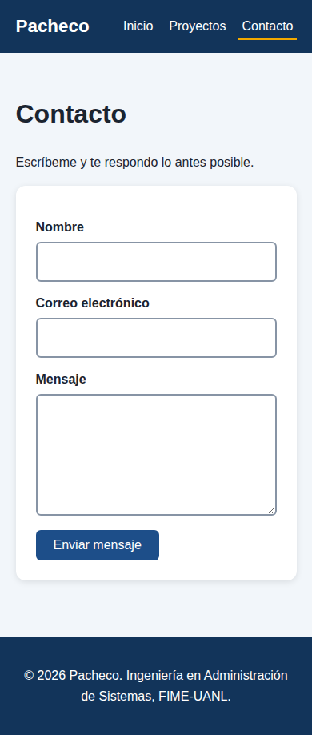

# Portafolio personal

## Objetivo
Sitio web responsivo, semántico y accesible que presenta mi perfil y mis proyectos como estudiante de Ingeniería en Administración de Sistemas (FIME-UANL).

## Tecnologías
HTML5 semántico, CSS3 (Flexbox y Grid) y un breakpoint a 700px para móvil. Sin frameworks ni JavaScript.

## Estructura
- `index.html`: Inicio y habilidades
- `proyectos.html`: Proyectos
- `contacto.html`: Formulario de contacto
- `styles.css`: Estilos
- `capturas/`: Capturas de escritorio y móvil

## Accesibilidad
Enlace para saltar al contenido, `alt` en imágenes, `label` en todos los campos del formulario, jerarquía de encabezados, `aria-current` en la navegación, foco visible y buen contraste.

## Capturas

| Página | Escritorio | Móvil |
|---|---|---|
| Inicio |  |  |
| Proyectos |  |  |
| Contacto |  |  |

## Resultados de validación
- HTML (`index.html`, `proyectos.html`, `contacto.html`): validados con el validador Nu del W3C (https://validator.w3.org/nu/). Sin errores ni advertencias.
- CSS (`styles.css`): validado con el mismo validador y con https://jigsaw.w3.org/css-validator/. Sin errores.

## Sitio publicado
https://TU-USUARIO.github.io/NOMBRE-DEL-REPOSITORIO/
